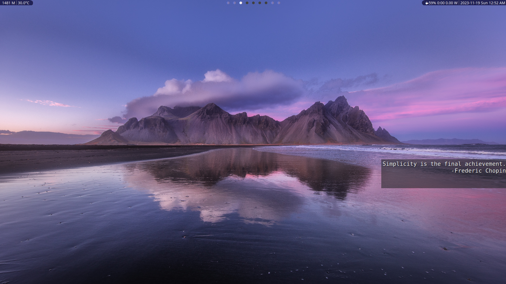

# Quotem

Quote 'em! Even in your minimalist setup you need quotes shown on your desktop to continue your journey towards minimalism and excellence! (At least I do ...) \
So here's my tiny Conky-setup for exactly that. It works with tiling window managers, not being focusable and close to no memory/CPU footprint.



## Installation

- Obviously you will need Conky.
- Run the ```make```-command. It will take care of the installation.
- If you already have a Conky-configuration, it will not get overwritten and you have to manually insert this config alongside the existing one.

## Uninstallation
```make uninstall```

## The quotes.toml-file

In ```~/.local/share/quotem/quotes.toml```, the quotes will be listed in the TOML-format.
See the following example:
```
[[quotes]]
text = "Kids, you tried your best and failed miserably. The lesson is never try!"
author = "Homer J. Simpson"
```

## Auto-Start after Boot
Simply add the following line to your xinitrc:
```shell
conky &
```
